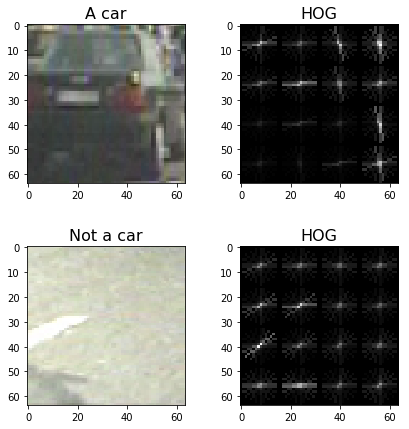
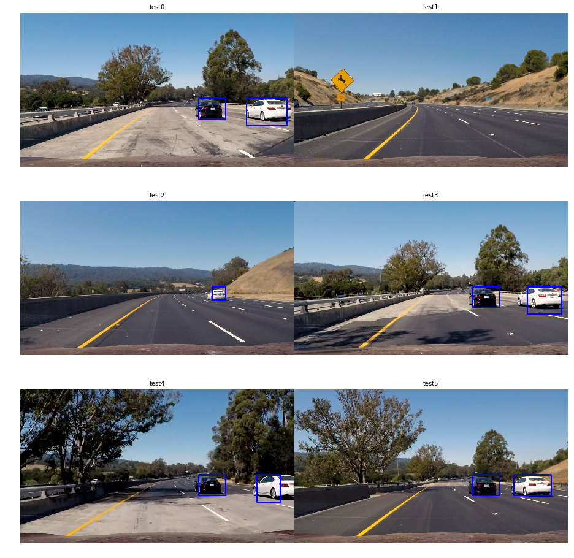

**Vehicle Detection Project**

## Built by Dmitry Zaganich in September 2017.

The goals / steps of this project are the following:

* Perform a Histogram of Oriented Gradients (HOG) feature extraction on a labeled training set of images and train a classifier Linear SVM classifier
* Optionally, you can also apply a color transform and append binned color features, as well as histograms of color, to your HOG feature vector. 
* Note: for those first two steps don't forget to normalize your features and randomize a selection for training and testing.
* Implement a sliding-window technique and use your trained classifier to search for vehicles in images.
* Run your pipeline on a video stream (start with the test_video.mp4 and later implement on full project_video.mp4) and create a heat map of recurring detections frame by frame to reject outliers and follow detected vehicles.
* Estimate a bounding box for vehicles detected.

## [Rubric](https://review.udacity.com/#!/rubrics/513/view) Points
### Here I will consider the rubric points individually and describe how I addressed each point in my implementation.  

---
### Histogram of Oriented Gradients (HOG)

#### Explain how (and identify where in your code) you extracted HOG features from the training images. Explain how you settled on your final choice of HOG parameters. Describe how (and identify where in your code) you trained a classifier using your selected HOG features (and color features if you used them).

The code for this step is contained in the section "Step 2. Histogram of Oriented Gradients (HOG)" of the IPython notebook P5.ipynb  

The functions which were used in this part of my project are:
* 'get_hog_features' gets hog features from an image;
* 'extract_features_from_image' converts image to a specified color space and calls get_hog_features on it;
* 'extract_features' gets features from an array of images; 
* 'train_classifier' extracts features from the dataset, splits it on training and test sets, trains classifier using provided parametres and returns a trained classifier and a score on the test set

Let's check how these histograms look like when we use different color spaces, orientations and apply them to different channels of an image. I did some research in the web and looked on the different approaches of the other students which I've found here: https://github.com/frankkanis/CarND-Student-Blogs. Although most of them used unique combinations of the parametres, I roughly determined the ranges of the parametres which I can later explore myself as follows:

```
test_colorspaces = ['YUV', 'RGB', 'HSV', 'LUV', 'HLS', 'YCrCb']
test_orientations = [7, 8, 9, 10, 11]
test_hog_channels = [0, 1, 2]
```

And when visualized them like:


The outputs of different sets of parametres look a lot similar, but we can observe that some of them, like the ones generated with HSV and YUV color spaces look like the ones which we can use.
I actually tried to guess the parametres when I started working on this project, but later I decided that I don't really need to guess them.
I can try them all and pick the best combination.

So I decided to do parameter tuning like that:

* Train SVC classifier on all of the combinations of the parametres
* Pick 10 combinations with the best score on the test set
* Manually provide these parametres to the pipeline and see which one works the best on the project video

Note, that I did not have to use normalization on my features, because I only use "hog" features in my pipeline.

The top-10 parameters sets according to the accuracy of the SVC on the test set are:

```
 Model parametres: 
 colorspace: YUV 
 hog_channel: ALL 
 orientation: 8 
 pix_per_cell: 16 
 cell_per_block: 2 

Model accuracy:  0.9856

 Model parametres: 
 colorspace: YUV 
 hog_channel: ALL 
 orientation: 9 
 pix_per_cell: 16 
 cell_per_block: 2 

Model accuracy:  0.9851

 Model parametres: 
 colorspace: YCrCb 
 hog_channel: ALL 
 orientation: 8 
 pix_per_cell: 16 
 cell_per_block: 2 

Model accuracy:  0.984

 Model parametres: 
 colorspace: YUV 
 hog_channel: ALL 
 orientation: 10 
 pix_per_cell: 16 
 cell_per_block: 2 

Model accuracy:  0.9828

 Model parametres: 
 colorspace: YUV 
 hog_channel: ALL 
 orientation: 10 
 pix_per_cell: 16 
 cell_per_block: 2 

Model accuracy:  0.9828

 Model parametres: 
 colorspace: YCrCb 
 hog_channel: ALL 
 orientation: 11 
 pix_per_cell: 16 
 cell_per_block: 2 

Model accuracy:  0.9825

 Model parametres: 
 colorspace: HLS 
 hog_channel: ALL 
 orientation: 10 
 pix_per_cell: 16 
 cell_per_block: 2 

Model accuracy:  0.9817

 Model parametres: 
 colorspace: YUV 
 hog_channel: ALL 
 orientation: 7 
 pix_per_cell: 16 
 cell_per_block: 2 

Model accuracy:  0.9814

 Model parametres: 
 colorspace: YUV 
 hog_channel: ALL 
 orientation: 7 
 pix_per_cell: 16 
 cell_per_block: 2 

Model accuracy:  0.9814

 Model parametres: 
 colorspace: YCrCb 
 hog_channel: ALL 
 orientation: 9 
 pix_per_cell: 16 
 cell_per_block: 2 

Model accuracy:  0.9803
```

It seems like using high values of "orientation" and all of the image channels is the way to go. However, it's not just about scores on the test set, right? I did not included results of my exploration of the top combinations, but in the end I determined that "YUV" color space provides the best result on the project test video, because all other top combinations gave me way more false positives on the video.

The final set of parametres for extracting HOG features is listed below:
* colorspace = 'YUV'
* orientation = 11
* all of the channels

Let's look how this set does on the random images of each class from the dataset:



### Sliding Window Search

#### 1. Describe how (and identify where in your code) you implemented a sliding window search.  How did you decide what scales to search and how much to overlap windows?

The code for this step is contained in the section "Step 3. Sliding Window Search" of the IPython notebook P5.ipynb  

My next step was to implement sliding window search in my pipeline. This step requires splitting image in so-called "windows" and then running previously trained classifier on them to detect ones with a car (or a portion of the car) in them.
I decided to cut my region of interest out of processed image (inspired by lanes detection project) so the pipeline will not waste valuable computational resources on the parts of image which are not that meaningful (like the upper half with trees and sky) and combine different window sizes to detect cars of different sizes in the frame. I used overlap of two times the cells.

The functions which were used in this part of my project:
* 'find_cars' combines color space conversion, getting a region of interest out of original image, hog feature extraction for an entire region of interest, sliding through the region and using the classifier to make predictions whether a window contains a car or not;
* 'draw_boxes' draws set of boxes with a specified or a random color on the original image
* 'draw_sliding_search' draws all of the search windows on the image and highlight the ones which were predicted as the ones with a car in them

My sliding search is pretty easy to use: it needs only top "y" position, scale of the search window and how many lines (steps) will be checked in the image with these parametres. Original size of a searching window was determined by the size of an image in the dataset, which is 64x64 pixels.
Let's see how it works out on a test image.


When I combined different scales and region of intrest to cover most of the road area:


And the final detection areas are looking like this:


#### 2. Show some examples of test images to demonstrate how your pipeline is working.  What did you do to optimize the performance of your classifier?

The code for this step is contained in the section "Step 5. Testing the pipeline" of the IPython notebook P5.ipynb

First of all, I did not used color and spatial features and it boosted computations because the pipeline does less operations. Second, I only looked in the determined regions of intrest in the image instead of processing the whole frame. With that I achieved speed of 2.4 frames per second on the project video.

These are the examples how my pipeline is working on the test images:



### Video Implementation

Here's a [link to my video result](./project_video_out_final.mp4)

#### 2. Describe how (and identify where in your code) you implemented some kind of filter for false positives and some method for combining overlapping bounding boxes.

The code for this step is contained in the section "Step 4. Identifying final detection boxes" of the IPython notebook P5.ipynb

In order to identify final detections I used heatmaps to eliminate false positives. The portion of image contains a false positive detection if there are smaller number of overlapping detected rectangles in it than it's required by detection threshold.
After eliminating all of the false positives we draw final detection area on the original image.

The functions which were used in this part of my project:
* 'add_heat' adds +1 to every pixel in the image which is located in the provided boxes
* 'apply_threshold' keeps only the pixels which had "heat" which exceeds a detection threshold. 
* 'draw_labeled_bboxes' draws final detection area on the original image using detections which were filtered by scipy.ndimage.measurements.label() function and heat threshold.

Here's an example result showing the heatmap from an image, thresholded heatmap and the result of `scipy.ndimage.measurements.label()` and the bounding boxes then overlaid on the last frame of video:


---

### Discussion

#### 1. Briefly discuss any problems / issues you faced in your implementation of this project.  Where will your pipeline likely fail?  What could you do to make it more robust?

The implemented pipeline, based on the HOG features and SVM classifier, does reasonably well on the project video. It looses the white car at some point for a second, but overall it detects cars in the video most of the time. It shows one false positive detection at the left side near the end of the video, but not for long.

To further improve the performance of the pipeline I could use more filters and more clever way to identify heat threshold than just dividing number of frames by two. I could experiment with deep learning instead of SVM classifier or I even could use YOLO "you only look once" architecture of neural network to make a robust classifier.

The pipeline is likely to fail on cars which are different from the ones in the dataset and the dataset is quite small for a robust learning, so getting a bigger dataset will result in better and more robust predictions.

It's also possible that pipeline will produce many false positives on roads with more distinct detectable items except from cars and the road itself, such as traffic signs. 

